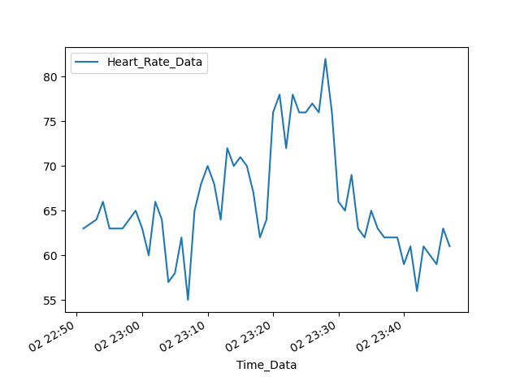
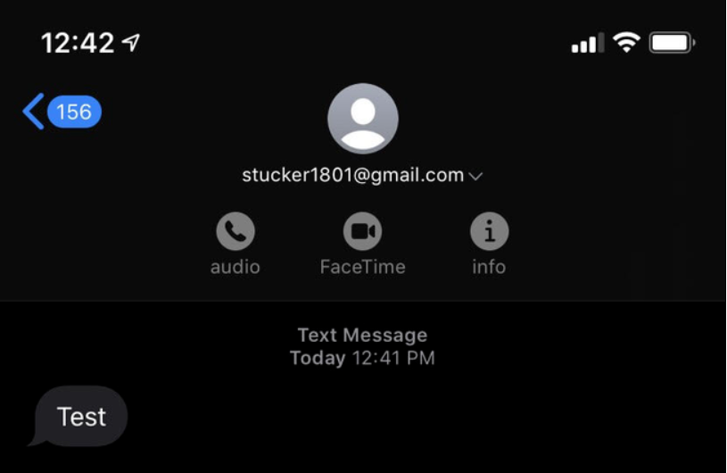

# Steven Tucker's Portfolio

Typically, I use the [Security Question Evaluator](https://github.com/SlidingSteven/SecurityQuestionEvaluator) app as my "go-to" project, but an external dependency has been giving us issues so I decided it would be a good opportunity to showcase some of the other work I have done.

## Table of Contents
* [Bigger Projects](#bigger-projects-)
  + [CenturyLink Automation Project](#CenturyLink-Automation-Project)
  + [SecurityQuestionEvaluator](#SecurityQuestionEvaluator-)
  + [WCAGCompChecker](#WCAGCompChecker)
  + [IHubPublicVideoRecorder](#IHubPublicVideoRecorder)
* [fitbit_API_demo.py](#fitbit_api_demo.py)
  + [Motivation](#motivation)
  + [About](#about)
* [spotify_API_Demo.py](#spotify_api_demopy)
  + [Motivation](#motivation-1)
  + [About](#about-1)
* [github_api.py](#github_api.py)
  + [Motivation](#motivation-2)
  + [About](#about-2)
* [gmail_to_text.py](#gmail_to_text.py)
  + [Motivation](#motivation-3)
  + [About](#about-3)
* [Big_12_Coaches.py](#big_12_coaches.py)
  + [Motivation](#motivation-4)
  + [About](#about-4)
* [Deal with any Math?](#deal-with-any-math-)

## Bigger Projects  

If you would like to see my work on a large scale, I would encourage you to peek at these repos-    
* ### CenturyLink Automation Project 
  - My biggest and most successful project was constructing a massive automation effort for my internship from the ground up, largely on my own.  This effort automated 7 project types and brought the runtime of these projects down from a typical 45 minute job to less than 1 minute.  This had a massive impact for my team because each project saved the company thousands of dollars and my team was able to reallocate time.  The repo is not available due to it being a product for CenturyLink but I used Flask, Requests, Pyodbc, Jinja, BeautifulSoup, and Selenium in this project.  

* ### [SecurityQuestionEvaluator](https://github.com/SlidingSteven/SecurityQuestionEvaluator) 
  - This was the largest public project I had made and unfortunately as I noted earlier, this seems to be a dwindling flame as IP addresses are being blocked.  The code will remain up and I think it still remains a good example of work I can do.

* ###  [WCAGCompChecker](https://github.com/Kiddkos/WCAGCompChecker) 
  - This was a team project to parse the html of a given web page to see if it would pass Web Content Accessibility Guidelines (WCAG) set by W3.  For this project we used Django and BeautifulSoup.

* ### [IHubPublicVideoRecorder](https://github.com/SlidingSteven/IHubPublicVideoRecorder) 
  - This was my first experience with Flask and the first large scale project I was involved with.  The purpose was to give users at the Innovation Hub a "video booth" to record a video about what they had made that day to be shared on our Facebook.  This particular project wasn't wildly successful but it was the project that sparked my interest in Python and webdevelopment.

## fitbit_API_demo.py

* ### Motivation  
  + I recently got a fitbit watch and I figured learning how to use thier API would be a good "exercise" (ba-dum-tsss)

* ### About  
  + In the file I have a few different methods for fetching different activities but heart rate has always been the most interesting to me.  This was a particularly challenging project because of the way they had authentication set up, but I learned a lot and had fun!  Below I have included the graph that I plotted in the script file.

&nbsp;&nbsp;&nbsp;&nbsp;&nbsp;&nbsp;

## spotify_API_Demo.py
* ### Motivation   
  + In some of my downtime I have been working on re-implementing the https://github.com/MichMich/MagicMirror in python just to keep skills sharp.  This project is still pretty new and not ready for any sort of live demo but I have attached one screenshot below, just to show what the spotify portion was supposed to do (bottom left).

* ### About   
  + You can read more on Magic-Mirrors here- https://magicmirror.builders/ 

&nbsp;&nbsp;&nbsp;&nbsp;&nbsp;&nbsp;

## github_api.py

* ### Motivation
  + My capstone project was with a company that requested an NDA so we had to provide some sort of proof we were doing productive work for the company and I decided it would be a good opportunity to try out Github's API.  

* ### About
  + Using Github's API I fetched each branch of the repo, and then each commit of each branch and logged output to a file that I could then send to the TA.  Since the repo is private I have modified the script to hit a public repo instead.  I also added a function to provide some work with Pandas and I included the associated graph below.

&nbsp;&nbsp;&nbsp;&nbsp;&nbsp;&nbsp;

## gmail_to_text.py

* ### Motivation
  + In my internship I would regularly run scripts that would take several hours to complete and wanted a way to notify me when they completed.

* ### About 
  + This script uses a gmail account to send "text" messages to a cell phone number.  If I wanted to scale it up, I could use the API for https://www.freecarrierlookup.com/ but since it was just for myself I didn't need to.

&nbsp;&nbsp;&nbsp;&nbsp;&nbsp;&nbsp;

## Big_12_Coaches.py

* ### Motivation
  + My capstone class required us to demonstrate a useful package that we were familiar with and I chose BeautifulSoup for my demonstration.  I chose this particular package because I had just finished using it in my internship the previous summer and I knew several of my classmates could benefit from learning about the tool.

* ### About 
  + I loaded a list of links to the wiki page for each football program in the Big 12 and my script would go through each link, finding the info box and parsing the coach name and program name out.  This was a very simple application of the library but it is really only meant to be a proof of concept.

## Deal with any Math?
Absolutely!  I have a minor in Math so it certainly came with the territory.  I have included two of note in this repository.  
* Statistics_project.html - This was my final project of my Statistics class and it aims to find a relationship between hummidity and percieved temperature.  This project was done in R and R markdown but I included it here because it shows my experience with processing large amounts of data.
* Algo_Report.html - This report was done for my Algorithm Analysis class.   It has some great examples of the ways I have applied Python to math.
* NumericalAnalysis-lab1.py / NumericalAnalysis-lab2.py - These labs were done in python for my numerical analysis class which covered how math on large data sets can impact performance.